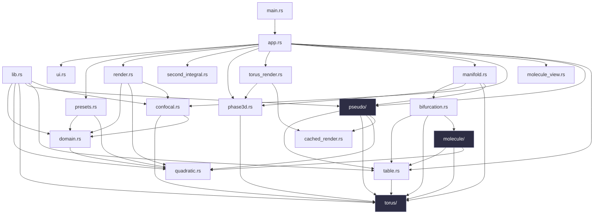
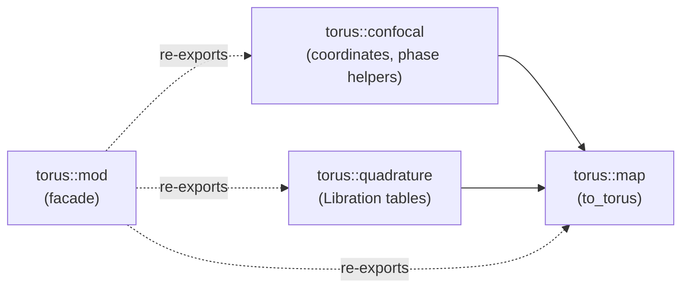
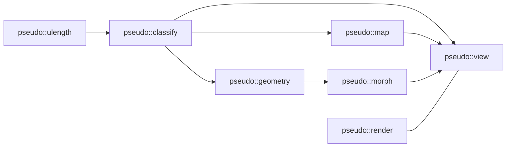
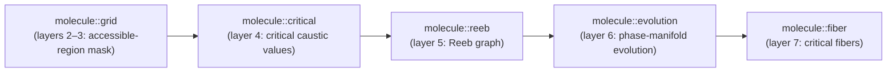
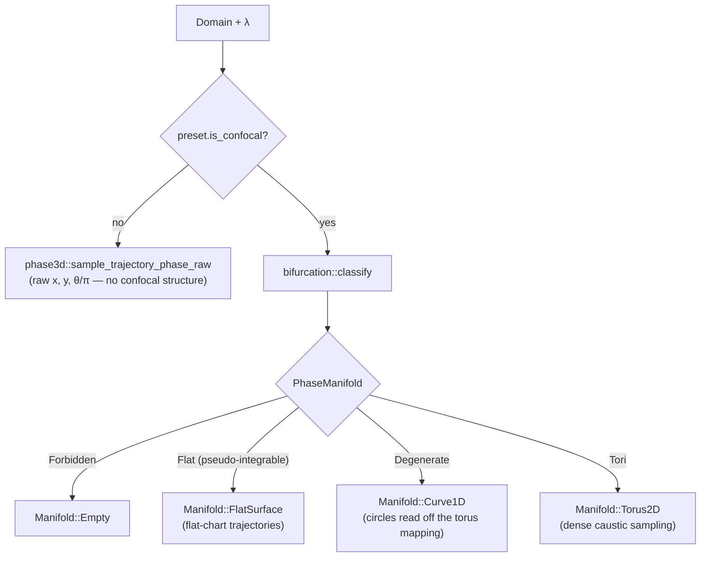

# Architecture

This is a map of the code, not the math. For the theory each module implements,
see [`../math/`](../math/README.md).

## Module layout

```
src/
├── main.rs               — entry point: loads the font, constructs App, runs it
├── lib.rs                — crate root: module re-exports, caustic start-point selection
├── app.rs                — the app loop: input → ViewState → draw
├── ui.rs                 — the Λ slider widget
├── presets.rs             — predefined domain configurations shown in the UI
│
├── domain.rs              — Domain & Segment: ray intersection, reflection,
│                            corner handling, L-shape / quadrilateral builders
├── quadratic.rs           — ConfocalQuadric: one quadric of the confocal family
│                            (evaluation, gradient, reflection, intersection)
├── table.rs               — Table: rectilinear occupancy grid of a confocal
│                            domain in the (λ₁, λ₂) chart
├── confocal.rs            — ConfocalStructure: reads a Domain's confocal walls,
│                            TorusRegime, caustic start-point sampling
│
├── render.rs              — 2D billiard drawing: Camera, CachedDomain, draw_*
├── second_integral.rs     — valid range of the second integral + slider mapping
├── molecule_view.rs       — the 2D molecule strip (Reeb graph over λ)
│
├── phase3d.rs             — 3D phase-space sampling, torus embedding, orbit
│                            camera, drawing
├── torus_render.rs        — cached offscreen rendering of the smooth torus
├── cached_render.rs       — render-to-texture cache shared by torus_render
│                            and pseudo::view
├── manifold.rs            — the single table `λ → renderable manifold`
│                            (Torus2D / Curve1D / FlatSurface / Empty)
├── bifurcation.rs         — "what phase manifold sits at a critical caustic
│                            level λc"
│
├── torus/                 — Liouville-torus machinery (integrable case)
│   ├── mod.rs             — module facade + re-exports
│   ├── confocal.rs        — confocal coordinates, phase-space helpers
│   ├── quadrature.rs      — Abelian-phase quadrature tables (Libration)
│   └── map.rs             — to_torus: phase-space sample → torus point
│
├── pseudo/                — pseudo-integrable machinery (reflex corners)
│   ├── mod.rs             — module facade + re-exports
│   ├── ulength.rs         — un-normalized length coordinates u(λ)
│   ├── classify.rs        — classify_level: forbidden / separatrix / torus / genus
│   ├── geometry.rs        — intrinsic geometry of a level (handle, pinch)
│   ├── map.rs             — to_flat: phase-space sample → flat coordinates
│   ├── morph.rs           — unified torus/genus-2 morph embedding
│   ├── render.rs          — 3D embeddings (torus, cross, pretzel)
│   └── view.rs            — sampling + drawing for the 3D view
│
└── molecule/               — the Fomenko-molecule engine (confocal domains)
    ├── mod.rs               — module facade + re-exports
    ├── grid.rs               — accessible-region mask over the λ-axis
    ├── critical.rs           — the finite set of critical caustic values
    ├── reeb.rs               — assembles vertices + edges into the Reeb graph
    ├── evolution.rs          — flat geometry / phase-manifold evolution
    ├── fiber.rs              — critical fibers
    ├── ellipse.rs            — full-ellipse front-end
    └── special.rs            — special layers, in ascending λ order

tests/
├── caustic_tests.rs          — caustic start-point validity
├── critical_layers.rs        — trajectories exist on degenerate (critical) layers
├── ellipse_phase.rs          — full-ellipse preset: phase manifold is two tori
│                                below the focal separatrix, one above
├── boundary_preimage_test.rs — π⁻¹(boundary): walls/caustic map onto the torus
├── highlight_invariants.rs   — per-torus highlight consistency
├── special_layers.rs         — every confocal preset exposes all its special
│                                layers as reachable start points
├── phase_consistency.rs      — phase-manifold consistency across a full sweep
├── second_integral.rs        — second-integral range mapping
├── standard_l_domain.rs      — Segment::intersect on the standard L's quadric arcs
├── l_singular_levels.rs      — bifurcations on the pseudo-integrable L-table
├── pseudo_topology.rs        — torus ↔ genus-2 by reflex-corner accessibility
├── pseudo_flat.rs            — flat-chart mapping correctness
├── pseudo_render.rs          — pseudo-integrable 3D renderers
├── molecule.rs                — molecule-engine correctness
├── torus_tests.rs             — torus-manifold topology
├── torus_render_test.rs       — renderer smoke test
└── torus_perf.rs               — orbit-performance (decimation, camera throttle)

examples/
└── check_layers.rs           — CLI dump of every confocal preset's special
                                 layers and their start-point counts
```

## Module dependency graph

Top-level modules, with `torus/`, `pseudo/` and `molecule/` collapsed to a
single node each — their internal structure follows below.



No circular dependencies. `quadratic.rs` is a leaf. `torus/` is the
integrable (Liouville) machinery; `pseudo/` is the pseudo-integrable
extension for tables with reflex corners; `molecule/` builds the Fomenko
molecule (the Reeb graph) on top of both.

### `torus/` — Liouville-torus machinery



### `pseudo/` — pseudo-integrable machinery



`pseudo::render` only needs level geometry (no dependency on `classify` or
`map`); `pseudo::view` is the one module that pulls the whole machinery
together to sample and draw a trajectory.

### `molecule/` — the Fomenko-molecule engine

The submodules form a pipeline over increasing λ-chart structure, each
building on the last (numbered per their own doc comments):



`molecule::ellipse` (full-ellipse front-end) and `molecule::special` (special
layers, in ascending λ order) sit outside this pipeline as consumers of it.

## `λ → renderable manifold` pipeline

What actually happens on every Λ change or preset switch, in
`ViewState::rebuild` (`app.rs`):



`Manifold::FlatSurface` is drawn by `pseudo::view`'s flat renderer;
`Manifold::Torus2D` and `Manifold::Curve1D` are drawn by `torus_render` /
`phase3d`'s torus embedding. See [`rendering.md`](rendering.md) for that half
of the pipeline in detail.
